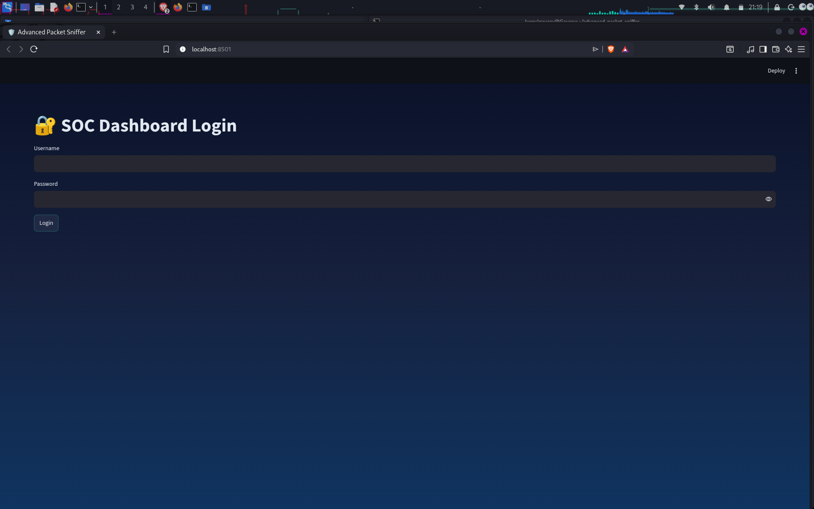
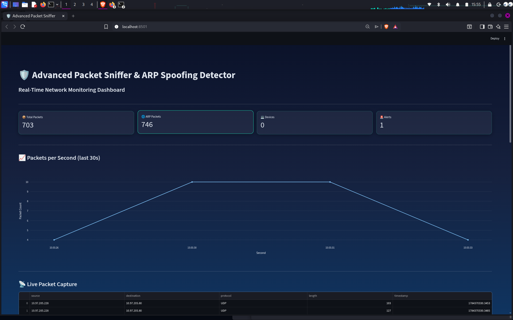
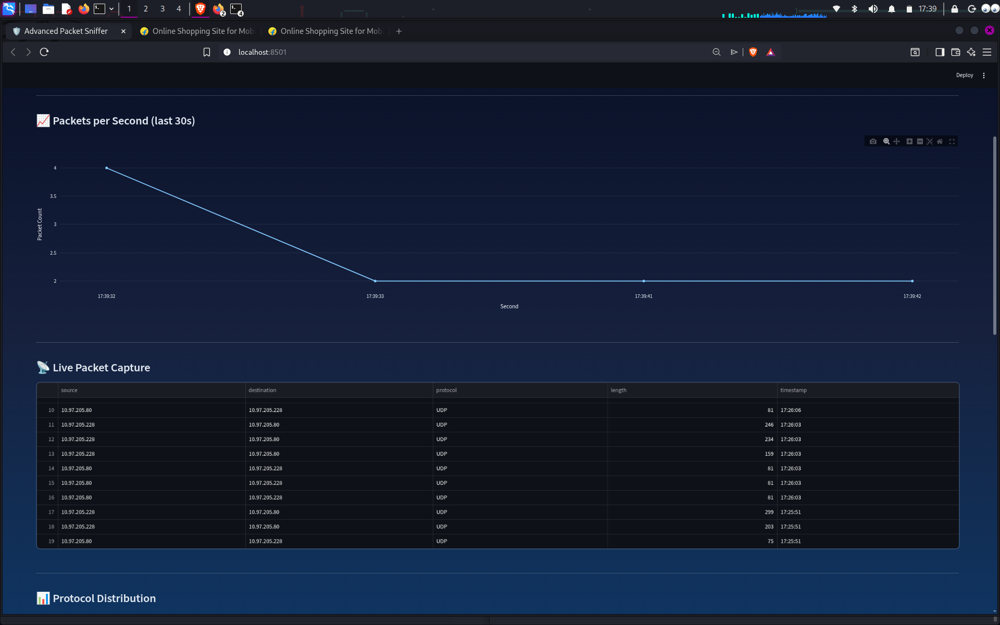
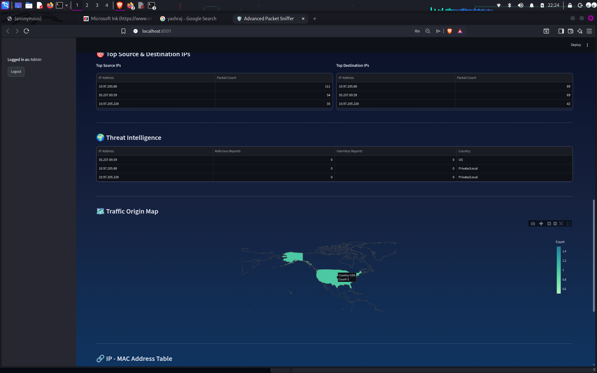
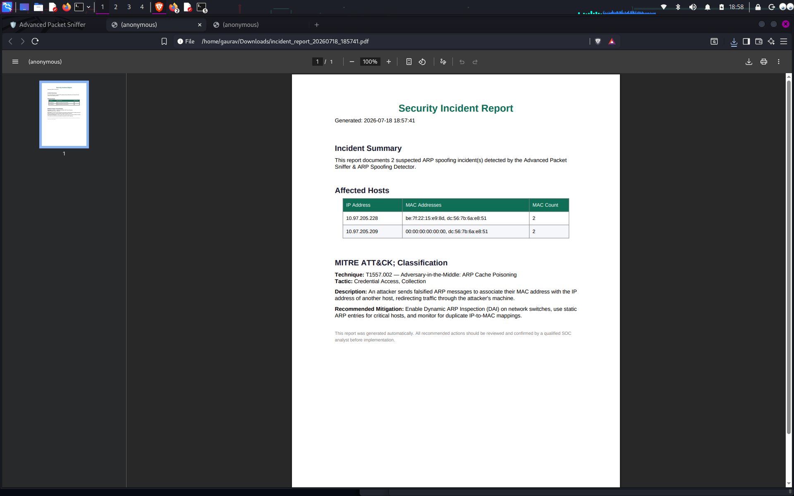
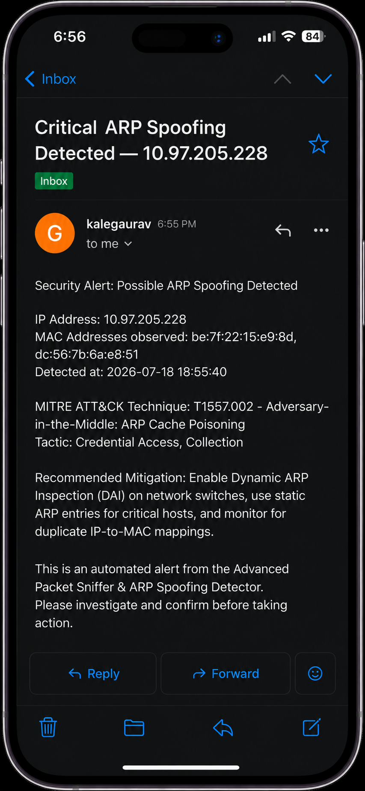

# 🛡️ Advanced Packet Sniffer & ARP Spoofing Detector

**Real-Time Network Monitoring | Threat Detection | MITRE ATT&CK | Threat Intelligence | PDF Reports | Email Alerts | Role-Based Access**


### 🚀 [**Live Demo →**](https://arp-spoofing-detector-demo.streamlit.app/

---

## 📖 Overview

**Advanced Packet Sniffer & ARP Spoofing Detector** is a real-time network security monitoring platform that captures live traffic, detects ARP spoofing attacks, enriches alerts with threat intelligence, and provides security analysts with MITRE ATT&CK context through an interactive dashboard.

> 🟢 **This project simulates a SOC (Security Operations Center) workflow** and helps analysts detect, investigate, and respond to network threats efficiently.

---

## 💡 Why This Project?

ARP spoofing is one of the most common yet under-monitored attacks on local networks — it lets an attacker silently intercept, redirect, or sniff traffic (Man-in-the-Middle) without the victim ever knowing. Most home/lab networks and even small organizations have **no real-time visibility** into this kind of Layer 2 attack.

This project was built to:

- 🎯 **Simulate a real SOC Analyst workflow** — from detection to investigation to reporting — instead of just theory.
- 🔍 **Gain hands-on experience** with packet-level network analysis using Scapy, rather than relying only on pre-built tools like Wireshark.
- 🧠 **Understand attacker behavior** by mapping detected threats directly to the **MITRE ATT&CK framework** (T1557.002 – ARP Cache Poisoning).
- 📊 **Bridge the gap between raw packet data and actionable intelligence** — enriching alerts with GeoIP/VirusTotal lookups and an AI-assisted investigation summary, the way a real threat intel pipeline works.
- 📄 **Practice incident response deliverables** — automated PDF reports and email alerts, similar to what a SOC team sends to stakeholders.
- 🚀 **Build a portfolio-worthy Cyber Security project** that demonstrates practical, end-to-end skills — not just a script, but a full monitoring platform with roles, dashboards, and reporting.

In short — this project turns a common but dangerous network attack into a **learning ground for real-world SOC operations**.

---

## ✨ Key Features

| | |
|---|---|
| 📡 Real-Time Packet Capture (Scapy) | 🌐 Threat Intelligence & GeoIP Lookup |
| 🛑 ARP Spoofing Detection | 🤖 AI-Assisted Investigation Summary |
| 📊 Live Monitoring Dashboard | 📄 Automated PDF Incident Reports |
| 📈 Traffic Statistics & Protocol Analysis | ✉️ Email Alerting System |
| 🖥️ Device Discovery | 🗄️ SQLite Logging |
| 🎯 MITRE ATT&CK Mapping | 🔐 Role-Based Authentication |

---

## 🔐 Authentication & Roles

| Role | Description | Permissions |
|------|-------------|-------------|
| 👑 **Admin** | Full system access | All Features |
| 🧑‍💻 **Analyst** | Monitor & investigate | Dashboard, Reports, Alerts |
| 👁️ **Viewer** | Read-only access | View Dashboard Only |

---

## 🏗️ System Architecture

```
                        User Login
                            │
                Authentication & Authorization
                            │
        ┌───────────────────┼───────────────────┐
      Admin               Analyst              Viewer
        └───────────────────┼───────────────────┘
                            │
              Advanced Packet Sniffer (Scapy Engine)
                            │
                     Packet Processing
        ┌───────────────────┼───────────────────┐
   ARP Detection      Protocol Analysis     Device Discovery
        └───────────────────┼───────────────────┘
                            │
                   Threat Detection Engine
        ┌───────────────────┼───────────────────┐
  SQLite Database     MITRE ATT&CK      Threat Intelligence
        └───────────────────┼───────────────────┘
                            │
                    AI Investigation Engine
                            │
                    Streamlit Dashboard
                     ┌──────┴──────┐
                Email Alerts   PDF Reports
```

---

## 🔄 Workflow

1. **Network Traffic** — Traffic flows through the network from various devices.
2. **Packet Capture** — Scapy captures live packets from the network interface.
3. **Packet Processing** — Packets are parsed and stored in the SQLite database.
4. **ARP Detection** — Detects IP-to-MAC mapping conflicts (ARP Spoofing).
5. **Threat Intelligence** — Looks up IP reputation using VirusTotal & GeoIP.
6. **MITRE Mapping** — Maps the attack to MITRE ATT&CK (T1557.002 – ARP Cache Poisoning).
7. **AI Investigation** — Generates a summary, risk score & recommended action.
8. **Dashboard** — Displays insights, stats, alerts & attack details.
9. **Email + PDF** — Sends email alerts & generates incident reports.

---

## 🖼️ Dashboard Preview

<table>
  <tr>
    <td align="center"><b>🔑 Login Page</b></td>
    <td align="center"><b>📊 Dashboard Overview</b></td>
  </tr>
  <tr>
    <td></td>
    <td></td>
  </tr>
  <tr>
    <td align="center"><b>📡 Live Packet Capture</b></td>
  </tr>
  <tr>
    <td></td>
  </tr>
  <tr>
    <td align="center"><b>🌍 Threat Intelligence (GeoIP)</b></td>
    <td align="center"><b>📄 PDF Incident Report</b></td>
  </tr>
  <tr>
    <td></td>
    <td></td>
  </tr>
  <tr>
    <td align="center"><b>✉️ Gmail Alert</b></td>
    <td align="center"><b>🏗️ System Architecture</b></td>
  </tr>
  <tr>
    <td></td>
    <td>
  </tr>
</table>

> 📌 Save the actual screenshots inside the `screenshots/` folder with the exact filenames above (`login.png`, `dashboard-overview.png`, `live-packet-capture.png`, `arp-spoofing-alert.png`, `threat-intelligence-geoip.png`, `pdf-incident-report.png`, `gmail-alert.png`, `architecture.png`) — GitHub will render them automatically once pushed.

---

## 🛠️ Technology Stack

- **Python** — Core language
- **Scapy** — Packet capture & analysis
- **Streamlit** — Interactive dashboard
- **SQLite** — Data storage
- **Plotly** — Data visualization
- **ReportLab** — PDF report generation
- **VirusTotal API** — Threat intelligence
- **SMTP** — Email alerting
- **CSS3** — Dashboard styling

---

## 📂 Project Structure

```
advanced-packet-sniffer/
├── assets/
├── data/
├── screenshots/
├── app.py
├── sniffer.py
├── arp_detector.py
├── ai_investigation.py
├── mitre_mapping.py
├── threat_intel.py
├── database.py
├── email_alert.py
├── report_generator.py
├── utils.py
├── style.css
├── requirements.txt
└── network_monitor.db
```

---

## ⚙️ Installation

```bash
# Clone the repository
git clone https://github.com/gauravkale391-blip/advanced-packet-sniffer.git
cd advanced-packet-sniffer

# Create a virtual environment
python -m venv venv
source venv/bin/activate      # On Windows: venv\Scripts\activate

# Install dependencies
pip install -r requirements.txt

# Run the dashboard (requires admin/root privileges for packet capture)
streamlit run app.py
```

> ⚠️ Packet sniffing requires elevated privileges. Run with `sudo` on Linux/macOS or as Administrator on Windows.

---

## ⚠️ Disclaimer

> This project is intended for **educational purposes and authorized security testing only**.
> Do not use it on any network without explicit permission.

---

## 👤 Author

**Gaurav Kale**
Computer Engineering Student | Cyber Security | SOC Analyst | Network Security Enthusiast

- 🔗 GitHub: [gauravkale391-blip](https://github.com/gauravkale391-blip)
- 🔗 LinkedIn: [gaurav-kale-391](https://linkedin.com/in/gaurav-kale-391)

---

## 📜 License

This project is licensed under the **MIT License** — see the [LICENSE](LICENSE) file for details.
